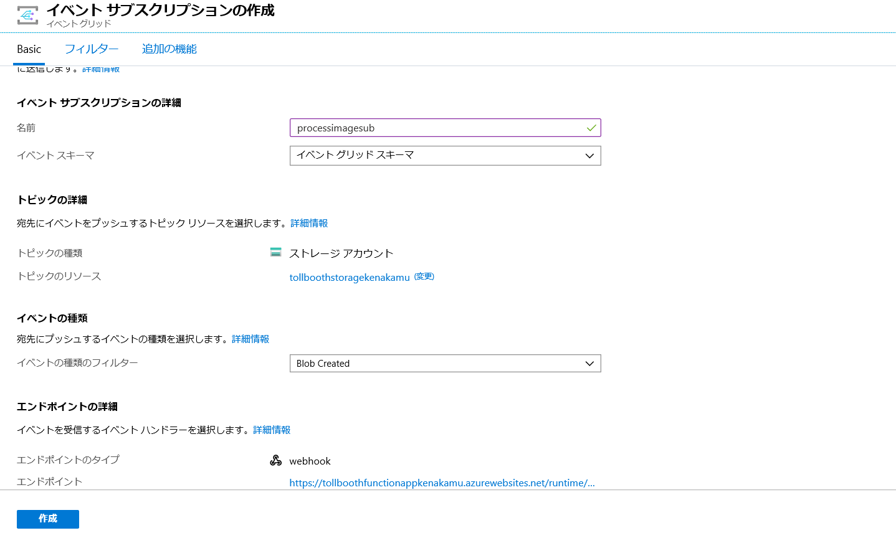
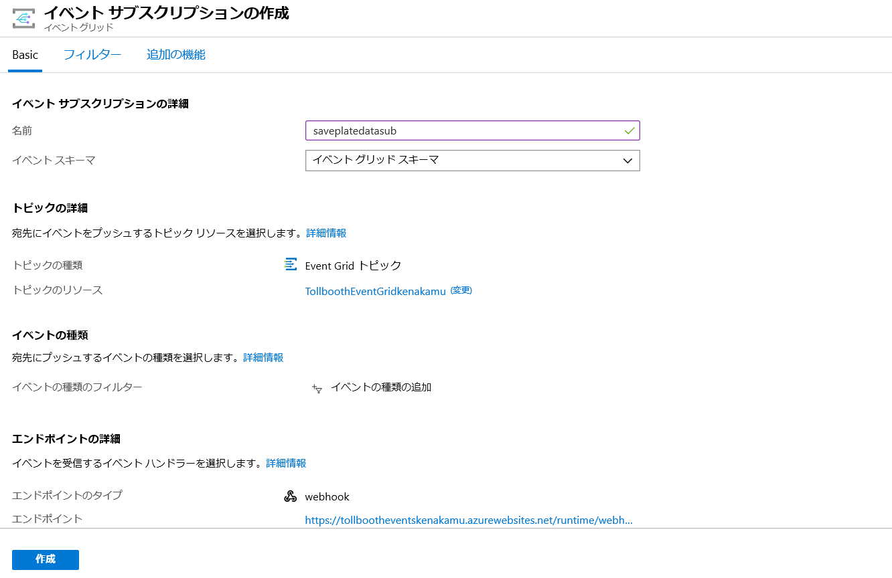
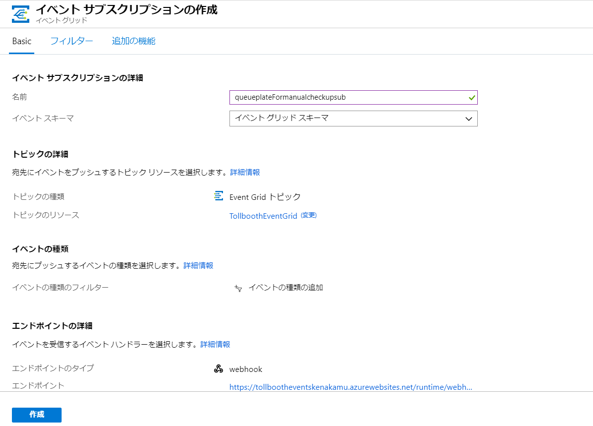
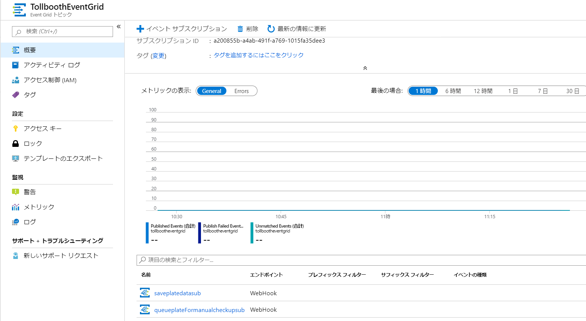
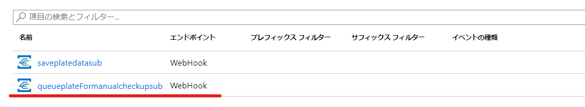

<div class="MCWHeader1">
サーバーレスアーキテクチャ
</div>

<div class="MCWHeader2">
ハンズオンラボ ステップバイステップガイド
</div>

<div class="MCWHeader3">
June 2019
</div>

Information in this document, including URL and other Internet Web site references, is subject to change without notice. Unless otherwise noted, the example companies, organizations, products, domain names, e-mail addresses, logos, people, places, and events depicted herein are fictitious, and no association with any real company, organization, product, domain name, e-mail address, logo, person, place or event is intended or should be inferred. Complying with all applicable copyright laws is the responsibility of the user. Without limiting the rights under copyright, no part of this document may be reproduced, stored in or introduced into a retrieval system, or transmitted in any form or by any means (electronic, mechanical, photocopying, recording, or otherwise), or for any purpose, without the express written permission of Microsoft Corporation.

Microsoft may have patents, patent applications, trademarks, copyrights, or other intellectual property rights covering subject matter in this document. Except as expressly provided in any written license agreement from Microsoft, the furnishing of this document does not give you any license to these patents, trademarks, copyrights, or other intellectual property.

The names of manufacturers, products, or URLs are provided for informational purposes only and Microsoft makes no representations and warranties, either expressed, implied, or statutory, regarding these manufacturers or the use of the products with any Microsoft technologies. The inclusion of a manufacturer or product does not imply endorsement of Microsoft of the manufacturer or product. Links may be provided to third party sites. Such sites are not under the control of Microsoft and Microsoft is not responsible for the contents of any linked site or any link contained in a linked site, or any changes or updates to such sites. Microsoft is not responsible for webcasting or any other form of transmission received from any linked site. Microsoft is providing these links to you only as a convenience, and the inclusion of any link does not imply endorsement of Microsoft of the site or the products contained therein.

© 2019 Microsoft Corporation. All rights reserved.

Microsoft and the trademarks listed at <https://www.microsoft.com/legal/intellectualproperty/Trademarks/Usage/General.aspx> are trademarks of the Microsoft group of companies. All other trademarks are property of their respective owners.

**コンテンツ**

<!-- TOC -->

- [サーバーレス アーキテクチャ ハンズオンラボ](#サーバーレス-アーキテクチャ-ハンズオンラボ)
  - [全体像と学習目的](#全体像と学習目的)
  - [概要](#概要)
  - [ソリューションアーキテクチャ](#ソリューションアーキテクチャ)
  - [前提条件](#前提条件)
  - [演習 1: Azure データ、ストレージ、サーバーレス環境のセットアップ](#演習-1-azure-データストレージサーバーレス環境のセットアップ)
    - [参照情報](#参照情報)
    - [タスク 1: ストレージアカウントの作成](#タスク-1-ストレージアカウントの作成)
    - [タスク 2: Function Apps の作成](#タスク-2-function-apps-の作成)
    - [タスク 3: Event Grid の作成](#タスク-3-event-grid-の作成)
    - [タスク 4: Azure Cosmos DB の作成](#タスク-4-Azure-Cosmos-DB-の作成)
    - [タスク 5: Computer Vision API service の作成](#タスク-5-Computer-Vision-API-service-の作成)
  - [演習 2: 写真の解析とデータをエクスポートする関数の作成](#演習-2-写真の解析とデータをエクスポートする関数の作成)
    - [参照情報](#参照情報-1)
    - [タスク 1: アプリケーション設定の構成](#タスク-1-アプリケーション設定の構成)
    - [タスク 2: 画像処理関数の完成](#タスク-2-画像処理関数の完成)
    - [タスク 3: Visual Studio から Function Apps を発行](#タスク-3-Visual-Studio-から-Function-Apps-を発行)
  - [演習 3: Azure ポータルから関数を作成](#演習-3-Azure-ポータルから関数を作成)
    - [参照情報](#参照情報-2)
    - [タスク 1: Cosmos DB へナンバープレートデータを保存する関数の作成](#タスク-1-Cosmos-DB-へナンバープレートデータを保存する関数の作成)
    - [タスク 2: SavePlateData 関数に Event Grid サブスクリプションを追加](#タスク-2-SavePlateData-関数に-Event-Grid-サブスクリプションを追加)
    - [タスク 3: SavePlateData 関数に Cosmos DB アウトプットバインディングを追加](#タスク-3-SavePlateData-関数に-Cosmos-DB-アウトプットバインディングを追加)
    - [タスク 4: Cosmos DB に手動検査用のデータを保存する関数の作成](#タスク-4-Cosmos-DB-に手動検査用のデータを保存する関数の作成)
    - [タスク 5: QueuePlateForManualCheckup 関数に Event Grid サブスクリプションを追加](#タスク-5-QueuePlateForManualCheckup-関数に-Event-Grid-サブスクリプションを追加)
    - [タスク 6: QueuePlateForManualCheckup 関数に Cosmos DB アウトプットバインディングを追加](#タスク-6-QueuePlateForManualCheckup-関数に-Cosmos-DB-アウトプットバインディングを追加)
    - [タスク 7: Event Grid カスタムイベントタイプのフィルタ設定](#タスク-7-Event-Grid-カスタムイベントタイプのフィルタ設定)
  - [演習 4: Application Insights で Function App を監視](#演習-4-Application-Insights-で-Function-App-を監視)
    - [参照情報](#参照情報-3)
    - [タスク 1: Application Insights の作成](#タスク-1-Application-Insights-の作成)
    - [タスク 2: Function Apps に Application Insights を追加](#タスク-2-Function-Apps-に-Application-Insights-を追加)
    - [タスク 3: ライブメトリックスストリームでリアルタイム監視](#タスク-3-ライブメトリックスストリームでリアルタイム監視)
    - [タスク 4: Function App の動的スケーリングを確認](#タスク-4-Function-App-の動的スケーリングを確認)
  - [演習 5: Cosmos DB のデータを参照](#演習-5-Cosmos-DB-のデータを参照)
    - [参照情報](#参照情報-4)
    - [タスク 1: Azure Cosmos DB データエクスプローラーの使用](#タスク-1-Azure-Cosmos-DB-データエクスプローラーの使用)
  - [演習 6: データをエクスポートするワークフローの作成](#演習-6-データをエクスポートするワークフローの作成)
    - [参照情報](#参照情報-5)
    - [タスク 1: Logic App の作成](#タスク-1-Logic-App-の作成)
  - [演習 7: Function App で継続的なデプロイを構成](#演習-7-Function-App-で継続的なデプロイを構成)
    - [参照情報](#参照情報-6)
    - [タスク 1: GitHub レポジトリの作成](#タスク-1-GitHub-レポジトリの作成)
    - [タスク 2: Visual Studio に GitHub レポジトリの追加](#タスク-2-Visual-Studio-に-GitHub-レポジトリの追加)
    - [タスク 3: Function App に GitHub からの継続的なデプロイを構成](#タスク-3-Function-App-に-GitHub-からの継続的なデプロイを構成)
    - [タスク 4: ExportLicensePlates の最新コードチェックインをトリガーに GitHub からデプロイ](#タスク-4-ExportLicensePlates-の最新コードチェックインをトリガーに-GitHub-からデプロイ)
  - [演習 8: ワークフローを再実行してデータエクスポートの確認](#演習-8-ワークフローを再実行してデータエクスポートの確認)
    - [タスク 1: Logic App の再開](#タスク-1-Logic-App-の再開)
    - [タスク 2: エクスポートされた CSV の確認](#タスク-2-エクスポートされた-CSV-の確認)
  - [ハンズオンが終わったら](#ハンズオンが終わったら)
    - [タスク 1: リソースグループの削除](#タスク-1-リソースグループの削除)
    - [タスク 2: GitHub レポジトリの削除](#タスク-2-GitHub-レポジトリの削除)

<!-- /TOC -->

# サーバーレス アーキテクチャ ハンズオンラボ

## 全体像と学習目的

このハンズオンラボでは、Microsoft Azure Functions、Azure Cosmos DB、Event Grid および関連サービスを利用した、エンドツーエンドのソリューション構築にチャレンジします。シナリオは、コンピュート、ストレージ、ワークフローや監視など、様々な Microsoft Azure のサービスを利用します。このハンズオンラボは一人でも実施できますが、実際の状況に近くなるよう、複数人での作業を強く推奨します。お互いの専門性を活用して学びあうことができます。

ハンズオンラボを完了する頃には、回復性が高くスケールし、コスト効果の高いサーバーレスソリューションの設計や構築、監視の実装に自信が持てることでしょう。

## 概要

コントソ有限会社では、大規模な料金所の管理サービスビジネスが急速に伸びています。現在、料金所を通過する車両のナンバープレートを自動で解析するという機能の要望が高まっています。大量の車両のナンバープレート写真を高速に処理して保存するソリューションの開発は、本業のオンライン決済ビジネスとは性質が異なるため、苦慮しています。現在はアウトソースによる手動の写真解析を行っており、解析結果は CSV ファイルとしてコントソ社に送られ、そこからオンライン処理システムに都度アップロードしています。コントソはこれらのプロセスをスケーラブルで費用効果の高い方法で、自動化したいと考えており、サーバレス技術が候補に挙がっていますが、詳しいエンジニアがいないため、実装できないでいます。

## ソリューションアーキテクチャ

以下の図はこのラボで実装するソリューションのアーキテクチャです。各演習では別々のコンポーネントを学ぶため、ここで全体像をしっかり見ておいてください。


ソリューションはナンバープレートを含む車両の写真が blob ストレージにアップロードされるところから始まります。blob に画像が保存されたことをトリガーに、 **Azure Functions** (画面左) が起動され、その中で **Cognitive Services Computer Vision API OCR** を使ってナンバープレートの情報を読み取ります。ナンバープレートから番号を取得できた場合、番号を含んだデータが `savePlateData` カスタムタイプとして **Event Grid** に送られます。読み取り処理が失敗した場合は、`queuePlateForManualCheckup` カスタムタイプとしてイベントが送られます。イベントはタイプごとにフィルターされ、それぞれが別の **Azure Functions** (画面中央) を起動し、結果が **Azure Cosmos DB** にアウトプットバインディング経由で保存されます。**Logic App** が 15 分ごとに実行され、HTTP トリガーで起動する **Azure Functions** (画面下部) が、Cosmos DB から保存されたデータを取得した後、CSV ファイルとして blob ストレージに結果をアップロードします。もし処理すべきデータがない場合は、Office 365 経由でカスタマーサービス部署にメールで通知します。**Application Insights** は全ての **Azure Functions** をリアルタイムで監視するモニターサービスとして機能し、動的スケーリングの動作や特定イベント発生時にアラート送るために使えます。

## 前提条件

- Microsoft Azure サブスクリプション
- 以下が構成されたローカルまたは仮想 PC (**ラボ前日までにセットアップしてください。**):
  - [Visual Studio Community 2019 以降](https://www.visualstudio.com/vs/)
  - [Visual Studio 2019 Azure ワークロード](https://docs.microsoft.com/azure/azure-functions/functions-develop-vs#prerequisites)
  - [.NET Framework 4.7 以降](https://www.microsoft.com/net/download/windows)
- Office 365 サブスクリプション: [体験版](https://portal.office.com/Signup/MainSignup15.aspx?Dap=False&QuoteId=79a957e-ad59-4d82-b787-a46955934171&ali=1)が利用可能
- [GitHub アカウント](https://github.com) 無償でアカウント作成可能 

## 演習 1: Azure データ、ストレージ、サーバーレス環境のセットアップ

**所要時間**: 30 分

ソリューションでは複数の Azure リソースを使用します。簡単に削除できるようすべて同じリソースグループに作成します。

この演習では、ホットアクセス層の blob ストレージアカウントを作成し、画像とエクスポートされる CSV ファイル用に 2 つのコンテナを作成します。その後、2 つの Function App インスタンスを作成します。1 つは Visual Studio から発行され、もう 1 つは Azure ポータル上で開発します。そして Event Grid を作成し、Cosmos DB と 2 つのコレクションも作成します。最後に画像の OCR 処理をする Cognitive Services Computer Vision API service を作成します。

### 参照情報

| **説明** | **リンク** |
| --- | :-- |
| ストレージ アカウントの作成 | https://docs.microsoft.com/ja-jp/azure/storage/common/storage-quickstart-create-account?toc=%2Fazure%2Fstorage%2Fblobs%2Ftoc.json%23create-a-storage-account&tabs=azure-portal |
| Azure Portal から Function App を作成する | https://docs.microsoft.com/ja-jp/azure/azure-functions/functions-create-function-app-portal |
| Azure Event Grid の概念 | https://docs.microsoft.com/ja-jp/azure/event-grid/concepts |
| Azure Cosmos アカウントを管理する | https://docs.microsoft.com/ja-jp/azure/cosmos-db/how-to-manage-database-account |

### タスク 1: ストレージアカウントの作成

1.  [Azure ポータル](http://portal.azure.com) にログイン。

2.  **+ リソースの作成** より **ストレージ** を選択し、**ストレージ アカウント**を選択。

    

3.  **ストレージ アカウントの作成**画面で以下を指定:

    a. **リソース グループ**: **ServerlessArchitecture**

    b. **ストレージ アカウント名**: **tollboothstorage** を含むグローバルで一意のもの

    c. **場所**: 近い場所

    d. **パフォーマンス**: **Standard**

    e. **アカウントの種類**: **StorageV2 (汎用 v2)**

    f. **レプリケーション**: **ローカル冗長ストレージ (LRS)**

    g. **アクセス層**: **ホット**

    

4.  **確認および作成**をクリック後、**作成**クリック。

5.  リソース作成後、**ServerlessArchitecture** リソースグループより作成した**ストレージアカウント**を開く。

    

6.  **アクセス キー** から **key1** と **接続文字列** をコピー。

    

7.  メモ帳などに保存。

8.  **Blob Service** メニューから **BLOB** を選択。**+ コンテナー**をクリックして、**名前** に **images** を指定、**パブリック アクセスレベル**は**プライベート (匿名アクセスはありません)** を選択して **OK** をクリック。

    

9.  同様に **export** コンテナも作成。

    

### タスク 2: Function Apps の作成

1. [Azure ポータル](http://portal.azure.com) にログイン。

2.  **+ リソースの作成** より **func** で検索して **Function App** をクリック。

    

3.  **作成**ボタンをクリック。

4.  **関数アプリ**画面で以下を指定:

    a. **リソース グループ**: **ServerlessArchitecture**

    b. **名前**: **TollBoothFunctionApp** を含むグローバルで一意のものを指定

    c. **ランタイム スタック**: **.NET Core**

    d. **地域**: 近い地域を選択。**次へ:ホスト中>** をクリック

    e. **ストレージ アカウント**: 新規作成または既存のものを選択

    f. **オペレーティング システム: **Windows**

    g. **プランの種類**: **従量課金プラン**を選択。**次へ:監視>**をクリック。

    h. **Application Insights を有効にする**: **いいえ** (後程設定する)

5.  **確認と作成**画面に移動して、**作成**をクリック。

    

6.  2 つ目の Function App も作成。

7.  **関数アプリ**画面で以下を指定:

    a.**リソース グループ**: **ServerlessArchitecture**

    b. **名前**: **TollBoothEvents** を含むグローバルで一意のものを指定

    c. **ランタイム スタック**: **Node.js**

    d. **地域**: 近い地域を選択。**次へ:ホスト中>** をクリック

    e. **ストレージ アカウント**: 新規作成または既存のものを選択

    f. **オペレーティング システム: **Windows**

    g. **プランの種類**: **従量課金プラン**を選択。**次へ:監視>**をクリック。

    h. **Application Insights を有効にする**: **いいえ** (後程設定する)

8.  **確認と作成**画面に移動して、**作成**をクリック。

    

### タスク 3: Event Grid の作成

1. [Azure ポータル](http://portal.azure.com) にログイン。

2.  **+ リソースの作成** より **event grid** を検索、**Event Grid Topic** を選択。

    

3.  **作成**をクリック。

4.  **トピックの作成**画面で以下を指定:

    a. **名前**: **TollboothEventGrid**

    b. **リソース グループ**: **ServerlessArchitecture**

    c. **場所**: 近い地域

    d. **イベント スキーマ**: **イベント グリッド スキーマ**

    

5.  **作成** をクリック。

6.  リソースの作成完了後、作成した Event Grid を開く。

7.  **概要** にある **トピック エンドポイント**をメモ帳などに保存。

    

8.  メニューの**アクセス キー**をクリック。

9.  **Key 1** の値をメモ帳などに保存。

    

### タスク 4: Azure Cosmos DB の作成

1. [Azure ポータル](http://portal.azure.com) にログイン。

2.  **+ リソースの作成** より **データベース**の **Azure Cosmos DB** を選択。

    

3.  **Azure Cosmos DB アカウントの作成**で以下を指定:

    a. **リソース グループ**: **ServerlessArchitecture**

    b. **アカウント名**: **tollboothdb** を含むグローバルで一意のものを指定

    c. **API**: **コア (SQL)**

    d. **場所**: 近い地域

    e. **goe 冗長性**: **無効**

    f. **マルチ リージョン書き込み**: **無効**

    

4.  **確認と作成**をクリック後、**作成**をクリック。

5.  リソース作成完了後、リソースを開く。

6.  **Containers** メニューにある **参照**をクリック。**コレクションの追加** をクリック。

    

7.  **コレクションの追加** では以下を指定:

    a. **Database id**: **LicensePlates**

    b. **Provision database throughput**: チェックをはずす

    c. **Container id**: **Processed**

    d. **Partition key**: **/licensePlateText**

    e. **Throughput**: **5000**

    

8)  **OK** をクリック。

9)  **New Container** をクリックして 2 つ目のコンテナを作成。

10) **Add Container** 画面で以下を指定。

    a. **Database id**: `Use existing` から **LicensePlates**

    b. **Container id**: **NeedsManualReview**

    c. **Partition key**: **/fileName**

    d. **Throughput**: **5000**

    

11) **OK** をクリック。

12) **設定**の**キー**をクリック。

13) **読み取り/書き込みキー**にある **URI** と **プライマリ キー**をメモ帳などに保存。

    

### タスク 5: Computer Vision API service の作成

1. [Azure ポータル](http://portal.azure.com) にログイン。

2.  **+ リソースの作成** より **computer vision** で検索して **Computer Vision** をクリック。

    

3.  **作成**をクリック

4.  **作成**で以下を指定:

    a. **名前**: **tollboothvisionINIT** を含むグローバルで一意のものを指定

    b. **場所**: 近い場所

    c. **価格レべル**: **S1**

    d. **リソース グループ**: **ServerlessArchitecture**

    

5.  **作成** をクリック。

6.  作成したリソースを開く。

7.  **クリック スタート** にある **Key1** と **エンドポイント**をメモ帳などに保存。

    

## 演習 2: 写真の解析とデータをエクスポートする関数の作成

**所要時間**: 45 分

Visual Studio の Azure Function 用ツールを使って開発した関数をローカルでデバッグ出来るほか、Azure へ直接発行することもできます。ラボリソースにある starter ソリューションに含まれる TollBooths プロジェクトにほとんどのコードが含まれます。

この演習では残りコードを実装して、最終的に Azure に発行します。

### 参照情報

| **説明** | **リンク** |
| --- | :-- |
| Azure Functions Core Tools の操作 | https://docs.microsoft.com/ja-jp/azure/azure-functions/functions-run-local |

### タスク 1: アプリケーション設定の構成

このタスクでは Azure ポータルから TollBooth アプリケーションが使う設定を構成します。

1.  [Azure ポータル](http://portal.azure.com) にログイン。

2.  **ServerlessArchitecture** リソースグループから **TollBoothFunctionApp** で始まる　Function　App を開く。

    

3.  **概要**から**構成**をクリック。

    

4.  **アプリケーション設定** で **+ 新しいアプリケーション設定**をクリックして以下設定を追加:

| **設定** | **値** |
| --- | :--: |
| computerVisionApiUrl     | 作成した Computer Vision の URL に vision/v2.0/ocr を追加したアドレス |
| computerVisionApiKey     | 作成した Computer Vision のキー |
| eventGridTopicEndpoint   | 作成した Event Grid のエンドポイント  |
| eventGridTopicKey        | 作成した Event Grid のキー |
| cosmosDBEndPointUrl      | 作成した Cosmos DB の URI |
| cosmosDBAuthorizationKey | 作成した Cosmos DB の プライマリ キー |
| cosmosDBDatabaseId       | LicensePlates |
| cosmosDBCollectionId     | Processed |
| exportCsvContainerName   | export |
| blobStorageConnection    | 作成したストレージ アカウントの接続文字列 |


> **メモ**: computerVisionApiUrl に vision/v2.0/ocr に追加を忘れると画像認識が動作しないため注意

5.  **保存**をクリック。

    

6.  (オプション) ローカルでデバッグする場合、以下の手順を実行

    a. local.settings.json に上記設定の値をペースト

    b. `AzureWebJobsStorage` と `AzureWebJobsDashboard` の値を上記アプリケーション設定より取得

### タスク 2: 画像処理関数の完成

Starter プロジェクトには、いくつか実装する必要のある TODO があります。このタスクでは ProcessImage プロジェクトにある FindLicensePlateText クラスで Computer Vision API を呼び出し、SendToEventGrid クラスが結果を Event Grid にカスタムイベントとして送信する TODO を完成させます。

> **メモ**: ソリューションに含まれる Nuget のバージョンを上げると意図せぬ問題が起こる可能性があります。

1.  **TollBooth** プロジェクト(/hands-on-lab/starts/TollBooth/TollBooth.sln) を Visual Studio で開く。

2.  **表示**から**タスク一覧**を選択。

    

3.  TODO の一覧と説明が表示される。

    

4.  **ProcessImage.cs** ファイルを開き、Run メソッドの `FunctionName` 属性の値が `ProcessImage` であることを確認。この属性が関数名として認識され、Event Grid からの HTTP 要求で起動される。後の手順で Blob のオブジェクト作成でトリガーされるサブスクリプションを作成。その結果 blob にオブジェクトが作成されると、オブジェクトの URL 情報を含んだイベントがエンドポイントに渡され、関数内で利用できるようになる。

5.  TODO 1 に以下のコードを差し込む。

```csharp
// **TODO 1: Set the licensePlateText value by awaiting a new FindLicensePlateText.GetLicensePlate method.**
licensePlateText = await new FindLicensePlateText(log, _client).GetLicensePlate(licensePlateImage);
```

6.  **FindLicensePlateText.cs** を開く。このクラスは Computer Vision API の機能である OCR を使ってナンバープレートの情報を読み取る。また [Polly](https://github.com/App-vNext/Polly) を使った回復パターン (Resiliency Pattern) を実装している。Polly はオープンソースの .NET ライブラリで通信エラーのハンドル処理を行う。回復パターンを実装することで、Computer Vision API が遅延したり停止している場合、それ以降の処理に問題がでないように処理することができる。

7.  TODO 2 に以下のコードを差し込む。

```csharp
// TODO 2: Populate the below two variables with the correct AppSettings properties.
var uriBase = Environment.GetEnvironmentVariable("computerVisionApiUrl");
var apiKey = Environment.GetEnvironmentVariable("computerVisionApiKey");
```

8.  次に **SendToEventGrid.cs** を開く。このクラスは Event Grid トピックに、ナンバープレートの情報を含むカスタムイベントを送信する役割がある。イベントはタイプ別でフィルターされ、それぞれ別の Function App で実行されるため、このコードに含まれるイベントタイプの情報を確認しておく。

9.  TODO 3 と TODO 4 に以下のコードを差し込む。

```csharp
// TODO 3: Modify send method to include the proper eventType name value for saving plate data.
await Send("savePlateData", "TollBooth/CustomerService", data);

// TODO 4: Modify send method to include the proper eventType name value for queuing plate for manual review.
await Send("queuePlateForManualCheckup", "TollBooth/CustomerService", data);
```

> **メモ**: その他の TODO は後程実装する

### タスク 3: Visual Studio から Function Apps を発行

このタスクでは、完了した Function App を Visual Studio から Azure に発行します。

1.  ソリューションエクスプローラーで **TollBooth** を開く。

2.  **TollBooth** を右クリックして**発行**をクリック。

    

3.  **Azure Function の従量課金制プラン**を選択し、**既存のものを選択**が選ばれている状態で、**発行**をクリック。

    

> **メモ**: 発行機能が存在しない場合、Visual Studio を更新してください。

4.  **リソースグループ**の一覧から **ServerlessArchitecture** を展開して、**TollBoothFunctionApp** を選択。

    

5.  **OK** をクリック。

    > **メモ**: Azure の Function App バージョンを更新するプロンプトが出た場合、ウィザードに従う。

6.  発行が完了するまで待機。

7.  [Azure ポータル](http://portal.azure.com) にログイン。

8.  **ServerlessArchitecture** リソースグループより、発行先とした Function App を開く。

9.  **関数**を展開して、2 つの関数が作成されていることを確認。

    

10. 次に Event Grid サブスクリプションを作成。**ProcessImage** 関数を開き **Event Grid サブスクリプションの追加**をクリック。

    

11. **イベント サブスクリプションの作成**画面で以下を指定:

    a. **名前**: **processimagesub**

    b. **イベント スキーマ**: **イベント グリッド スキーマ**

    c. **トピックの種類**: **Storage Accounts**

    d. **リソースグループ**と **Subscription** で **ServerlessArchitecture** を選択

    e. 作成したストレージアカウントを指定

    f. **イベントの種類のフィルター**: **Blob Created** のみ選択

    g. エンドポイントの詳細は既定

12. **作成**をクリック。

    

## 演習 3: Azure ポータルから関数を作成

**所要時間**: 45 分

この演習では Azure ポータルより Node.js ランタイムの Azure Function を作成し、関数を 2 つ追加します。これらの関数は ProcessImage が処理した結果が Event Grid に送られた際にトリガーされ、結果を Cosmos DB に保存します。

### 参照情報

| **説明** | **リンク** |
| --- | :-- |
| Azure Portal で初めての関数を作成する | https://docs.microsoft.com/ja-jp/azure/azure-functions/functions-create-first-azure-function |
| Azure Functions と Azure Cosmos DB を使用して非構造化データを格納する | https://docs.microsoft.com/ja-jp/azure/azure-functions/functions-integrate-store-unstructured-data-cosmosdb?tabs=csharp |

### タスク 1: Cosmos DB へナンバープレートデータを保存する関数の作成

このタスクでは Event Grid からトリガーされ、ナンバープレートの読み取りに成功したデータを Cosmos DB に格納する Node.js 関数を実装します。

1.  [Azure ポータル](http://portal.azure.com) にログイン。

2.  **ServerlessArchitecture** リソースグループで **TollBoothEvent** を含む Function App を開く。

3.  **+ 新しい関数** をクリック。

    

4.  **ポータル内**を選択して、**続行**をクリック。

    

5.  **その他のテンプレート**を選択して、**テンプレートの完了と表示**をクリック。

    

6.  **event grid** で検索して、**Azure Event Grid trigger** を選択。

    

    a. 拡張機能がインストールされていないメッセージが出たら、**インストール**をクリック。

    

    b. インストールが完了したら、**続行**をクリック。

7.  **名前**に `SavePlateData` と入力して、**作成**をクリック

    

8.  関数のコードを以下と差し替え:

```javascript
module.exports = function(context, eventGridEvent) {
  context.log(typeof eventGridEvent);
  context.log(eventGridEvent);

  context.bindings.outputDocument = {
    fileName: eventGridEvent.data['fileName'],
    licensePlateText: eventGridEvent.data['licensePlateText'],
    timeStamp: eventGridEvent.data['timeStamp'],
    exported: false
  };

  context.done();
};
```

9.  **保存**をクリック。

### タスク 2: SavePlateData 関数に Event Grid サブスクリプションを追加

このタスクでは SavePlateData 関数に Event Grid サブスクリプションを追加し、savePlateData イベントを受け取れるようにします。

1.  SavePlateData 関数を開き **Event Grid サブスクリプションの追加**をクリック。

    

2.  **イベント サブスクリプションの作成**画面で以下を指定:

    a. **名前**: **saveplatedatasub** 

    b. **イベント スキーマ**: **イベント グリッド スキーマ**

    c. **トピックの種類**: **Event Grid Topics**

    d. **リソースグループ**と **Subscription** で **ServerlessArchitecture** を選択

    e. 作成した Event Grid トピックを選択

    f. **イベントの種類のフィルター**: 後で設定するため今は既定

    g. エンドポイントの詳細は既定
    
3.  **作成**をクリック。

    

### タスク 3: SavePlateData 関数に Cosmos DB アウトプットバインディングを追加

このタスクでは SavePlateData 関数に Azure Cosmos DB アウトプットバインディングを追加します。

1.  **SavePlateData** 関数を展開し、**統合**をクリック

2.  出力メニューにある **+ 新しい出力** から **Azure Cosmos DB** をクリックして、**選択**をクリック

    

3.  **Azure Cosmos DB アカウント接続** の横にある**新規**をクリック。

    

    > **メモ**: `拡張機能がインストールされてません`のメッセージが出たら、**インストール**をクリックし、インストールが完了するまで待機。

    

4.  リストの一覧から、作成した Cosmos DB を選択。

5.  以下のように他の項目も設定:

    a. **データベース名**: **LicensePlates**

    b. **コレクション名**: **Processed**

    

6.  **保存**をクリック。

    > **メモ**: 拡張機能がインストールされていない場合、インストールが完了するまで待つ。

### タスク 4: Cosmos DB に手動検査用のデータを保存する関数の作成

このタスクでは、ナンバープレートの読み取りに失敗した場合、Event Grid から通知される写真の情報を Cosmos DB に書き込む関数を作成します。

1.  **関数**の画面より **+ 新しいい関数**をクリック。

    

2.  **event grid** で検索して、**Azure Event Grid trigger** を選択。
 
    

3.  **名前**に **QueuePlateForManualCheckup** と入力して、**作成**をクリック。

    

4. 以下のコードを張り付け、**保存**をクリック。

```javascript
module.exports = async function(context, eventGridEvent) {
  context.log(typeof eventGridEvent);
  context.log(eventGridEvent);

  context.bindings.outputDocument = {
    fileName: eventGridEvent.data['fileName'],
    licensePlateText: '',
    timeStamp: eventGridEvent.data['timeStamp'],
    resolved: false
  };

  context.done();
};
```

### タスク 5: QueuePlateForManualCheckup 関数に Event Grid サブスクリプションを追加

このタスクでは QueuePlateForManualCheckup に Event Grid サスペンションを追加し、 queuePlateForManualCheckup カスタムイベントを受け取れるようにします。

1.  QueuePlateForManualCheckup 関数で **Event Grid サブスクリプションの追加**をクリック。

    

2. **イベント サブスクリプションの作成**画面で以下を指定:

    a. **名前**: **queueplateFormanualcheckupsub**

    b. **イベント スキーマ**: **イベント グリッド スキーマ**

    c. **トピックの種類**: **Event Grid Topics**

    d. **リソースグループ**と **Subscription** で **ServerlessArchitecture** を選択

    e. 作成した Event Grid トピックを選択

    f. **イベントの種類のフィルター**: 後で設定するため今は既定

    g. エンドポイントの詳細は既定

3.  **作成**をクリック

    

### タスク 6: QueuePlateForManualCheckup 関数に Cosmos DB アウトプットバインディングを追加

このタスクでは QueuePlateForManualCheckup 関数に Azure Cosmos DB アウトプットバインディングを追加して、NeedsManualReview イベントの中身を書き出します。

1.  QueuePlateForManualCheckup 関数を展開して、**統合**をクリック。

2.  出力メニューにある **+ 新しい出力** から **Azure Cosmos DB** をクリックして、**選択**をクリック

    

3.  **Azure Cosmos DB アウトプットフォーム**で以下を設定:
   
    a. **データベース名**: **LicensePlates**

    b. **コレクション名**: **NeedsManualReview**

    c. **Azure Cosmos DB アカウント接続**: 既存のものを選択

    

4.  **保存**をクリック。

### タスク 7: Event Grid カスタムイベントタイプのフィルタ設定

このタスクでは Event Grid から通知されるイベントをタイプでフィルタして、適切な Function App が起動できるように設定します。

1.  [Azure ポータル](http://portal.azure.com) にログイン。

2.  **ServerlessArchitecture** リソースグループより Event Grid を開く。

3.  **概要**の下の方にあるビューより **saveplatedatasub** を開く。

    

4.  **フィルター**タブをクリック。

5.  **イベントの種類の追加**をクリックして、**savePlateData** を指定。

    

6.  **保存**をクリック。

7.  同様に **queueplateformanualcheckupsub** を開く。

    

8. **フィルター**タブをクリック。

9. **イベントの種類の追加**をクリックして、**queuePlateForManualCheckup** を指定。

10. **保存**をクリック。

## 演習 4: Application Insights で Function App を監視

**所要時間**: 45 分

Application Insights は Azure Function に統合でき、強力な監視機能を提供します。この演習では Azure Function で使う Application Insights を作成、構築すると共に、送られてくるテレメトリーの確認や Function App の動的スケールの様子も確認します。

### 参照情報

| **説明** | **リンク** |
| --- | :-- |
| Azure Functions を監視する | https://docs.microsoft.com/ja-jp/azure/azure-functions/functions-monitoring |
| Live Metrics Stream:1 秒の待機時間での監視と診断 | https://docs.microsoft.com/ja-jp/azure/azure-monitor/app/live-stream |

### タスク 1: Application Insights の作成

1. [Azure ポータル](http://portal.azure.com) にログイン。

2.  **+ リソースの追加**より **application insights** で検索して **Application Insights** を選択。

    

3.  **作成**をクリック。

4.  **Application Insights** の作成画面で以下を指定:

    a. **リソース グループ**: **ServerlessArchitecture**

    b. **名前**: **TollboothMonitor** を含むグローバルで一意のものを指定

    c. **地域**: 近い地域を指定

    

5.  **確認して作成**をクリック後、**作成**をクリック。

### タスク 2: Function Apps に Application Insights を追加

このタスクでは Function Apps がテレメトリーを送信できるよう Application Insights を構成します。

1.  **ServerlessArchitecture** リソースグループより、作成した **Application Insights** を開く。

2.  **概要**にある、**インストルメンテーションキー**をコピー。

    

3.  **TollBoothFunctionApp** で始まる Function App を開く。

4.  **概要**の**構成**をクリック。

5.  **+ 新しいアプリケーション設定**をクリックし、**APPINSIGHTS_INSTRUMENTATIONKEY** を追加。コピーしたインストルメンテーションキーを値に設定。

    

6.  **OK** をクリック。

7.  一覧の画面で、**保存**をクリック

    

8.  もう 1 つの Function App でも同じ作業を行う。

### タスク 3: ライブメトリックスストリームでリアルタイム監視

このタスクでは Application Insights のライブメトリックスストリームを使って監視を行います。

1.  **TollBoothFunctionApp** から始まる Function App を開く。

2.  **全般**より、**Application Insights** を選択。

    > **メモ**: 表示さえるまで時間がかかる場合があります。

    

3.  メニューから **ライブ メトリックス ストリーム**を選択。

    

4.  ライブメトリックスストリームの画面は開いたままで、Visual Studio へ移動。

5.  ソリューションエクスプローラーより **UploadImages** を確認。

    

6.  **App.config** を開く。

7.  **blobStorageConnection** にストレージアカウントの接続文字列を張り付け

    

8.  変更を保存。

9.  **UploadImages** プロジェクトを右クリックし、**デバッグ** | **新しいインスタンス**を選択。

    

10. コンソール画面が出たら、**1** と入力して **ENTER** キーを押下

    

11. ライブメトリックスストリームの画面に戻って、Application Insights でテレメトリーを受信していることを確認。現在のサーバー台数や、要求の処理時間などを確認することができ、右側にあるログから詳細も確認可能

    

12. 現在の近祖ソールを閉じて、再度 `UploadImages` をデバッグ実行。今度は 2 を選択。これで写真が 1000 枚アップロードされる。

    

13. ライブメトリックスストリームの画面に戻って、再度状況を確認。サーバーの台数は処理が効率よく行われていれば、2 から変化がない。また要求の処理時間は ~500ms 程度となっている。CPU の利用率と要求のグラフも、波が一致していることを確認。

    

14. しばらくしたらコンソールは閉じる。ライブメトリックスストリームの画面はまだ使うのでそのまま。

### タスク 4: Function App の動的スケーリングを確認

このタスクでは Computer Vision API の価格レベルを F0 に変更し、OCR が 1 分で 10 件までしか処理できない状態にします。これにより UploadImages が写真を 1000 枚アップロードした際、FindLicensePlateText.MakeOCRRequest の処理が遅くなることを受け、平均の処理時間も長くなります。Function App は全ての処理をタイムリーに実行できるよう、動的にスケールアウトしますが、ライブメトリックスストリームでその動作を確認します。

1.  **ServerlessArchitecture** リソースグループより **Computer Vision API サービス**を開く。

2.  **価格レベル** を選択して、**S1 Standard** から **F0 Free** に変更後、**選択**をクリック。

    > **メモ**: すでに **F0** を他のリソースグループで使っている場合 Cognitive Service の価格レベルは変更できません。

    

3.  **UploadImages** を再度デバッグ実行して **2** を選択。

    

4.  ライブメトリックスストリームに戻って状況を確認。要求の処理時間が延びるにつれて、サーバーの台数が増加していることを確認。サーバーが起動する度、ログには "Generating 2 job function(s)" と表示される。また回復パターンによって Computer Vision API 要求の応答が HTTP ステータス 429 であるものに対して再実行している模様も確認可能。

    > **Note**: データが処理され始めない場合、Function App を再起動

    

5.  数分したら UploadImages を停止

6.  **Computer Vision API** の価格レベルを **S1 Standard** に戻す。

## 演習 5: Cosmos DB のデータを参照

**所要時間**: 15 分

この演習では Azure Cosmos DB に保存されたデータを Azure ポータルより確認します。

### 参照情報

| **説明** | **リンク** |
| --- | :-- |
| Azure Cosmos DB 概要 | <https://docs.microsoft.com/ja-jp/azure/cosmos-db/introduction> |

### タスク 1: Azure Cosmos DB データエクスプローラーの使用

1.  **ServerlessArchitecture** リソースグループより **Azure Cosmos DB** を開く。

2.  **データ エクスプローラー**を選択。

    

3.  **Processed** コレクションを展開して **Items** をクリック。 JSON ドキュメントが格納されていることを確認。

4.  任意の 1 つのドキュメントをクリック。初めの 4 プロパティは Function App によって作成されたもので、他は Cosmos DB によって付与されたプロパティ。

    

5.  **NeedsManualReview** コレクションの **Items** も確認。

6.  任意の 1 つのドキュメントをクリック。先ほどと同様に、初めの 4 プロパティは Function App によって作成されたもので、他は Cosmos DB が付与。4 つのプロパティのうち resolved は手動での検査が完了したかを示すフラグ。このラボでは扱わないが、このようなプロパティを使って後続処理をすることが可能。

    

7.  **Processed** を右クリックして **New SQL Query** をクリック。

    

8.  以下のクエリを張り付けて実行。

```sql
SELECT VALUE COUNT(c.id) FROM c WHERE c.exported = false
```

9.  クエリの結果、ここでは 309 件がエクスポート対象であることがわかる。

    

## 演習 6: データをエクスポートするワークフローの作成

**所要時間**: 30 分

この演習では Logic App を使ってデータエクスポートワークフローを作成します。Logic App から定期的に ExportLicensePlates 関数を呼び出し、処理対象が存在しない場合は別途メールで通知を行います。

### 参照情報

| **説明** | **リンク** |
| --- | :-- |
| Azure Logic Apps 概要 | https://docs.microsoft.com/ja-jp/azure/logic-apps/logic-apps-overview |
| Azure Logic Apps から Azure Functions を呼び出す | https://docs.microsoft.com/ja-jp/azure/logic-apps/logic-apps-azure-functions |

### タスク 1: Logic App の作成

1. [Azure ポータル](http://portal.azure.com) にログイン。

2.  **+ リソースの追加**より **logic app** で検索し、**Logic App** を選択。

    

3.  **作成**をクリック。

4.  **Logic App 作成** 画面で以下を指定:

    a. **名前**: **TollBoothLogic**

    b. **リソースグループ**: **ServerlessArchitecture**

    c. **場所**: 近い場所を指定

    d. **Log Analytics**:  **Off**

    

5.  **作成**をクリック。完了したらリソースへ移動。

6.  **Log Apps デザイナー**のトリガーから、**繰り返し**を選択

    

7.  **間隔**を **15** 分に設定

8.  **+ 新しいステップ**をクリック

    

9.  **Functions** で検索して **Azure Functions** を選択。

    

10. **TollBoothFunctionApp** で始まる関数を選択。

    

11. **ExportLicensePlates** を選択。

    

12. この関数は特にパラメーターが必要ない。次に **+ アクションを追加**をクリックして、**条件**で検索。アクションより**条件**を選択。

    

13. **値フィールド**に**状態コード**を指定。**次の値に等しい**を選択して **200** を値に指定。

    > **メモ**: `ExportLicensePlates` 関数は処理の結果、ナンバープレートからデータを取り出せた場合は HTTP 応答 200 が返り、それ以外は 204 (NoContent) が返る。この条件は 200 とそれ以外で分岐している。

    

14. 結果が 200 の場合は **true の場合**ブランチに処理が遷移するが、今回は正常処理の場合は何もしない。失敗した場合 **false の場合**で**新しいアクション**をクリック。

    

15. **メールの送信**で検索して、Office 365 Outlook から**メールの送信**をクリック。

    

16. **サインイン**をクリック。

    

17. メールの送信画面で以下を設定:

    a. **宛先**: 任意の宛先を設定

    b. **件名**: **料金所でのナンバープレートエクスポートに失敗**と入力

    c. **本文**: 任意のテキストと共に `ExportLicensePlates` の**状態コード**を利用

    

18. Logic Apps デザイナーで**保存**をクリック。

19. **実行**をクリックすると即座にワークフローが実行され、`ExportLicensePlates` 関数が実行され Cosmos DB から取得した情報が CSV 形式で blob にアップロードされる。

    

20. 実行中にはデザイナー画面で実行状況がリアルタイムに表示され、ボックスをクリックすると詳細も確認可能。

    

21. ワークフローは 15 分ごとに実行され続けるため、**概要**から**無効**をクリックして停止。

    

## 演習 7: Function App で継続的なデプロイを構成

**所要時間**: 40 分

この演習では ProcessImage 関数を含む Function App のデプロイを、GitHub レポジトリと連携して継続的に行えるように設定をします。

### 参照情報

| **説明** | **リンク** |
| --- | :-- |
| 新しいリポジトリの作成 | https://help.github.com/ja/articles/creating-a-new-repository |
| Azure Functions の継続的なデプロイ | https://docs.microsoft.com/ja-jp/azure/azure-functions/functions-continuous-deployment |

### タスク 1: GitHub レポジトリの作成

1.  [GitHub](https://github.com) に自身の GitHub アカウントでログイン。

2.  画面右上の **+** より **New repository** をクリック。

    

3.  任意の名前を **Repository name** に指定。**Public** を選択して **Create repository** をクリック。

    > **メモ**: **Public** を選択すると、すべて情報が公開さえれるため、キー情報や接続文字列を公開しないよう注意。

    

4.  **HTTPS git path** をコピー。

    

### タスク 2: Visual Studio に GitHub レポジトリの追加

1.  Visual Studio で **TollBooth** プロジェクトを開く。

2.  **TollBooth** プロジェクトを右クリックして、**ソリューションをソース管理に追加**をクリック。

    

3.  **表示**メニューより、**チーム エクスプローラー**を選択。

    

4.  全ての変更を保存。

5.  チームエクスプローラーで、**同期**をクリック。

    

6.  **リモート レポジトリにプッシュ**より **Git レポジトリを発行**をクリック。コピーしたアドレスをペーストして、**公開**をクリック。

    

7.  GitHub に戻り画面をリフレッシュし、ソースコードが同期されていることを確認。**TollBooth** フォルダに移動して local.settings.json ファイルが公開されていない事を確認。これは .gitignore にファイルが含まれており、公開対象になっていないため。このように .gitignore を活用して必要な情報のみを同期する。

    

### タスク 3: Function App に GitHub からの継続的なデプロイを構成

1.  Azure ポータルで **TollBoothFunctionApp** から始まる Function App を開く。

2.  **プラットフォーム機能**より、**デプロイ センター**をクリック。

    

3.  **GitHub** を選択して、**承認**をクリック。承認ウィンドウが起動するので、サインインや承認をウィザードに従って完了し、**続行**をクリック。

    

4.  **App Service のビルドサービス**を選択し、**続行**をクリック。

    

5.  まず GitHub 組織を選択。

6.  そしてリポジトリとブランチを選択。

    

7.  **続行**をクリック。

8.  サマリーページで、**完了**をクリック。

9.  継続的なデプロイを構成すると、ソースコードの変更は Function App にコピーされ、デプロイが実行される。その後のファイル更新でも都度デプロイがトリガーされる。

### タスク 4: ExportLicensePlates の最新コードチェックインをトリガーに GitHub からデプロイ

1.  Visual Studio で **TollBooth** を開く。

2.  **表示**から、**タスク一覧**を選択。

    

3.  TODO リストが表示される。

4.  **DatabaseMethods.cs** を開く。

5.  TODO 5 に以下のコードを挿入:

```csharp
// TODO 5: Retrieve a List of LicensePlateDataDocument objects from the collectionLink where the exported value is false.
licensePlates = _client.CreateDocumentQuery<LicensePlateDataDocument>(collectionLink,
        new FeedOptions() { EnableCrossPartitionQuery=true,MaxItemCount = 100 })
    .Where(l => l.exported == false)
    .ToList();
```

6.  TODO 6 直下のコードをコメントアウト: 
```csharp
// TODO 6: Remove the line below.
//licensePlates = new List<LicensePlateDataDocument>();.
```
7.  変更を保存してから、**FileMethods.cs** を開く。

8.  TODO 7 に以下のコードを挿入:

```csharp
// TODO 7: Asyncronously upload the blob from the memory stream.
await blob.UploadFromStreamAsync(stream);
```

9.  変更を保存・

10. **TollBooth** を右クリックして、**ソース管理** | **コミット**をクリック。

    

11. コミットコメントを入れてから、**すべてをコミット**を選択。

    

12. コミットが完了したら、**同期**リンクをクリックする。

    

13. **同期タブ**に遷移後に、**同期**をクリック。

    

    クリック後、入力方向/出力方向ともに同期のインジケーターが表示される。

14. Azure ポータルから　Function App の**デプロイ センター**に戻る。ソースコードの同期をトリガーにデプロイが実行される。

    

## 演習 8: ワークフローを再実行してデータエクスポートの確認

**所要時間**: 10 ?

この演習では、Function App のコードが最新になったため、無効にした Logic App を再度有効にして、その動作を確認します。

### タスク 1: Logic App の再開

1.  Azure ポータルより、先ほど作成して無効にした Logic App を開く。

2.  **全般**の**有効**をクリック。

    

3.  **トリガーの実行**より **Recurrence** をクリックする。

    

4.  **最新の情報に更新**して、最新のログを表示。ログを開いて、関数の結果から条件が満たされ、結果が **true** であることを確認。この場合、ナンバープレートの情報が CSV となり blob に格納される。

    

### タスク 2: エクスポートされた CSV の確認

1.  **ServerlessArchitecture** リソー―スグループより **ストレージ アカウント**を選択。

2.  **Blob service** メニューの**コンテナー**をクリック。

    

3.  **export** コンテナを選択。

    

4.  任意の CSV を選択し、詳細のブレードから **ダウンロード**をクリック。
    
    

5. CSV は以下のようなデータを含んでいる。

    

`ExportLicensePlates` 関数は、各ドキュメントの exported プロパティを `true` に変更。その後の処理で同じドキュメントが実行されないようにする。Cosmos DB を開いて、先ほど実行した SQL の結果を再度確認。

## ハンズオンが終わったら

**所要時間**: 10 分

ハンズオンは以上で終わりです。以下の手順で作成した不要なリソースを削除します。

### タスク 1: リソースグループの削除

1.  Azure ポータルより **ServerlessArchitecture** リソースグループを選択して?**リソース グループの削除**をクリック。

2.  リソースネームを入力して、**削除**をクリック。

3.  他のリソースグループにもリソースを作成した場合は、そちらも併せて削除。

### タスク 2: GitHub レポジトリの削除

1.  [GitHub](https://www.github.com) ページより先ほど作ったレポジトリを選択。

2.  **Settings** メニューの一番下にある **Delete this repository** をクリックしてレポジトリを削除。
